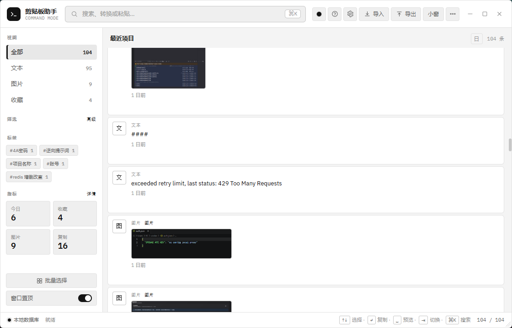
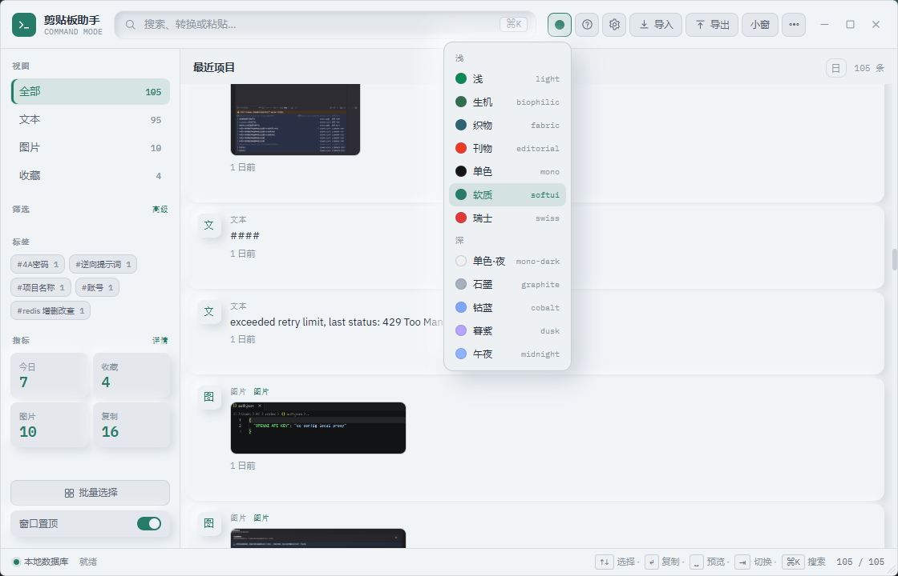

# 剪贴板助手

一个本地运行的剪贴板历史与快速粘贴工具，基于 Tauri 2、Vue 3、TypeScript 和 Rust 构建。

它会在后台记录系统剪贴板中的文本和图片，需要时通过快捷键唤出窗口，搜索、筛选、整理并快速粘贴历史内容。

## 截图

### 主界面



### 主题切换



### 设置与隐私规则


## 功能

- 后台监听系统剪贴板，保存文本和图片历史
- 文本按内容去重，重复复制时刷新到顶部
- 图片转为 PNG 文件保存到本地库
- 默认使用 `Ctrl+Shift+V` 全局快捷键唤起窗口
- 支持搜索文本和标签
- 支持按类型、时间、复制次数、正则、大小写筛选
- 支持标签、收藏、日期分组和批量操作
- 点击条目后写入剪贴板，并可自动粘贴到当前应用
- 支持只写入剪贴板，不自动粘贴
- 支持图片预览、打开链接、格式化 JSON、复制域名
- 支持小窗模式和完整管理模式
- 支持窗口置顶
- 内置 12 套主题
- 支持隐私规则：忽略应用、忽略敏感窗口标题、临时暂停监听
- 系统托盘菜单支持最近 5 条快捷粘贴
- 支持 JSON 导入 / 导出
- 支持使用统计和高频条目查看

## 快捷键

| 快捷键 | 作用 |
|---|---|
| `Ctrl+Shift+V` | 显示或隐藏窗口，可在设置中修改 |
| `Ctrl/⌘ + K` | 聚焦搜索框 |
| `Ctrl/⌘ + M` | 切换小窗模式 |
| `↑` / `↓` | 上下选择条目 |
| `Enter` | 复制并自动粘贴选中条目 |
| `Ctrl + Enter` | 只写入剪贴板，不自动粘贴 |
| `Space` | 预览选中条目 |
| `Tab` | 在全部、文本、图片、收藏视图之间切换 |
| `Esc` | 关闭弹窗、退出多选或隐藏主窗口 |

## 技术栈

- Tauri 2
- Vue 3
- TypeScript
- Rust
- SQLite / `rusqlite`

## 开发

安装依赖：

```bash
npm install
```

启动开发模式：

```bash
npm run tauri dev
```

前端主文件：`src/App.vue`

后端主文件：`src-tauri/src/lib.rs`

## 构建

生成可直接运行的 exe：

```bash
npx tauri build --no-bundle
```

生成 NSIS 安装器：

```bash
npx tauri build --bundles nsis
```

更详细的 Windows 打包说明见 `BUILD.md`。

## 发布

本地构建产物放在 `release/` 目录。

`release/` 已被 Git 忽略。请通过 GitHub Releases 上传 exe 或安装器，不要直接提交到源码仓库。

## 可重新生成的目录

以下目录都是构建或依赖产物，不需要提交：

- `node_modules/`
- `dist/`
- `src-tauri/target/`
- `release/`

从干净仓库重新开发或构建前，先执行 `npm install`。

## 许可证

本项目遵循 `LICENSE` 文件中的许可证条款。
